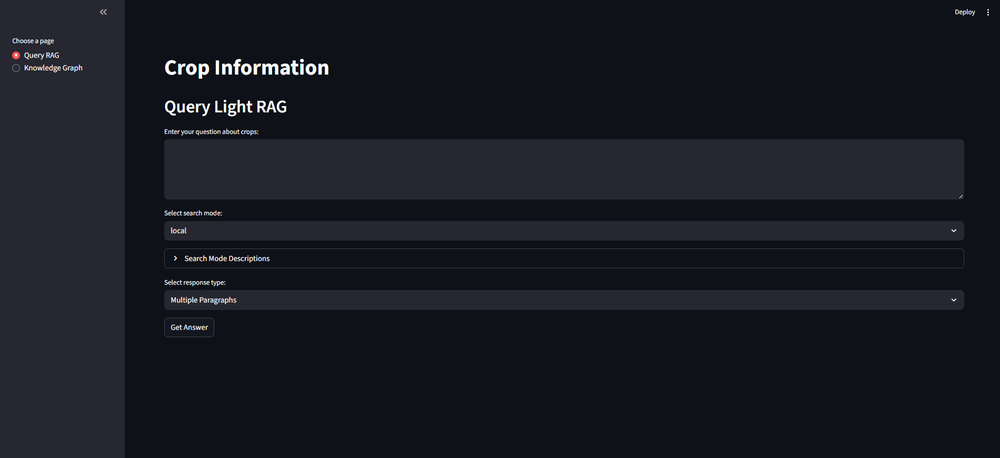
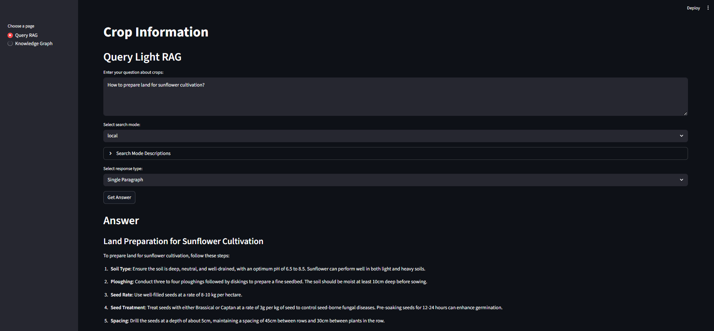
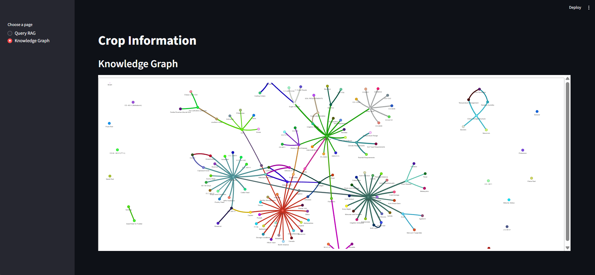

# Light-RAG Crop Information Extractor

This project demonstrates the use of the `light-rag` library to build a Retrieval-Augmented Generation (RAG) system. It processes a collection of text documents about various crops, builds a knowledge graph, and allows users to ask questions about the content. The system also includes a feature to visualize the underlying knowledge graph.

## Features

- **Document Processing**: Ingests text files from a specified directory (`inputs/crops/`).
- **Knowledge Graph Construction**: Automatically builds a knowledge graph from the document contents, storing entities and relationships.
- **Vector Database**: Creates and stores vector embeddings for efficient semantic search.
- **Natural Language Queries**: Allows users to ask questions in natural language and receive answers based on the processed documents.
- **Interactive Visualization**: Generates an interactive HTML file (`knowledge_graph.html`) to visualize the relationships between different entities in the knowledge graph.

## Project Structure

```
.
├── .python-version
├── requirements.txt
└── test-light-rag/
    ├── test-light-rag.py      # Main script to build the knowledge base
    ├── query.py               # Script to ask questions to the RAG system
    ├── graph_viz.py           # Script to generate the knowledge graph visualization
    ├── app.py                 # Script to run the interactive web application
    ├── inputs/
    │   └── crops/             # Source .txt documents
    └── rag-working-dir/       # Stores the generated knowledge graph, vector DBs, and caches
```

## Setup

1.  **Python Version**: This project uses Python `3.12`. Ensure you have it installed and activated in your environment.

2.  **Install Dependencies**: Install the required Python packages using `requirements.txt`.
    ```bash
    pip install -r requirements.txt
    ```

3.  **API Keys**: The project uses OpenAI's `gpt-4o-mini` model. You need to have an OpenAI API key. Create a file named `.env` in the root directory and add your key like this:
    ```
    OPENAI_API_KEY="your-api-key-here"
    ```

## Usage

Follow these steps to run the RAG pipeline.

### 1. Build the Knowledge Base

First, run the `test-light-rag.py` script. This will read all the text files from the `test-light-rag/inputs/crops/` directory, process them, and create the necessary knowledge base files in `test-light-rag/rag-working-dir/`.

```bash
python test-light-rag/test-light-rag.py
```
You should see output indicating that the RAG has been initialized and the documents have been inserted successfully.

### 2. Query the Knowledge Base

Once the knowledge base is built, you can ask questions. Open the `test-light-rag/query.py` file and modify the question in the `main` function.

```python
# Inside test-light-rag/query.py
async def main():
    rag = await load_rag()
    # --- Change the question below ---
    await query_rag(rag, "What are the common diseases for potatoes?")

```

Then, run the script:
```bash
python test-light-rag/query.py
```
The answer will be printed to the console.

### 3. Visualize the Knowledge Graph

To see a visual representation of the extracted information, run the `graph_viz.py` script.

```bash
python test-light-rag/graph_viz.py
```

This will generate a file named `knowledge_graph.html` in the `test-light-rag` directory. Open this file in your web browser to explore the interactive graph of entities and their relationships.

## Interactive Web Application

This project also includes an interactive web application built with Streamlit. The `app.py` script launches a web server that provides a user-friendly interface to interact with the RAG system.

### Running the Web Application

To run the web application, use the following command:

```bash
streamlit run test-light-rag/app.py
```

This will open a new tab in your web browser with the application.

### Features

The web application has two main pages:

1.  **Query RAG**: This page allows you to enter a question and receive an answer from the RAG system. You can also select different search modes and response types.
2.  **Knowledge Graph**: This page displays the interactive knowledge graph visualization, allowing you to explore the entities and relationships extracted from the documents.

### Demo

Here is a short video demonstrating the web application in action:


### Snapshots

Here are some snapshots of the web application:

**Query Page**



**Query Run**



**Knowledge Graph**


